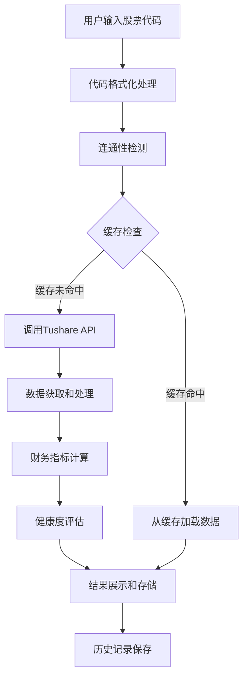

# 📊 A股财务分析系统 - 业务开发文档

## 📋 文档信息

- **项目名称**: A股财务分析系统
- **版本**: 2.0.0
- **作者**: gaomindu
- **更新日期**: 2025-11-13
- **技术栈**: Python 3.8+, Streamlit, Tushare Pro API, Plotly

## 🎯 项目概述

### 1.1 业务背景

A股财务分析系统是一个基于审计意见与三大核心财务指标的智能筛选系统，帮助投资者快速评估公司财务健康状况。该系统通过分析资产负债率、毛利率、经营现金流等关键指标，为投资者提供直观的财务健康度评分。

### 1.2 核心价值

- **量化评估**: 将复杂的财务数据转换为0-3分的直观评分
- **行业差异**: 不同行业采用差异化的评估标准
- **实时缓存**: 24小时持久化缓存，提升查询效率
- **可视化展示**: 交互式图表展示趋势变化
- **智能估值**: 基于市赚率(PR)的买卖时机判断

### 1.3 主要功能

1. **单项分析**: 深度分析单只股票的财务数据
2. **市赚率估值**: 基于PE和ROE的估值方法
3. **历史记录**: 分析历史管理和趋势追踪

## 🏗️ 系统架构

### 2.1 整体架构

```
┌─────────────────┐    ┌─────────────────┐    ┌─────────────────┐
│   Streamlit UI  │────│  业务逻辑层     │────│   数据访问层     │
│                 │    │                 │    │                 │
│ - 用户界面     │    │ - 数据处理      │    │ - Tushare API   │
│ - 交互控制     │    │ - 指标计算      │    │ - 缓存管理      │
│ - 图表展示     │    │ - 估值分析      │    │ - 数据存储      │
└─────────────────┘    └─────────────────┘    └─────────────────┘
         │                       │                       │
         └───────────────────────┼───────────────────────┘
                                 │
                    ┌─────────────────┐
                    │   缓存层        │
                    │                 │
                    │ - Redis-like    │
                    │ - 文件系统      │
                    │ - 24小时过期    │
                    └─────────────────┘
```

### 2.2 技术架构

- **前端框架**: Streamlit - 快速构建数据应用的Python框架
- **数据源**: Tushare Pro API - 中国A股专业数据接口
- **数据处理**: Pandas - 高效的数据分析和处理
- **可视化**: Plotly - 交互式图表库
- **缓存系统**: 自建文件缓存系统，模拟Redis功能
- **配置管理**: Python模块配置，环境变量支持

### 2.3 项目结构

```
自我研究开发/
├── app.py                 # 🎯 主应用入口
├── utils.py              # 🔧 数据获取和处理核心
├── cache_manager.py      # 💾 缓存管理系统
├── valuation.py          # 📊 市赚率估值算法
├── settings.py           # ⚙️ 配置文件
├── requirements.txt      # 📦 依赖管理
├── data/                 # 💽 数据存储目录
│   ├── cache/           # 缓存文件目录
│   └── analysis_history.json  # 历史记录
├── test_token.py         # 🧪 Token测试
├── test.py              # 🧪 连通性测试
└── README.md            # 📖 项目说明
```

## 💼 核心业务逻辑

### 3.1 单项分析业务流程

#### 3.1.1 分析流程图



#### 3.1.2 数据获取流程

1. **代码规范化**: 自动补全交易所后缀(.SH/.SZ/.BJ)
2. **连通性检测**: DNS、HTTP、API三重检测
3. **缓存检查**: 24小时有效期缓存机制
4. **API调用**: 按序调用5个接口（公司信息、审计、三大表）
5. **数据整合**: 合并多表数据，计算核心指标

#### 3.1.3 财务指标计算

**资产负债率**: `total_liab / total_assets`
**毛利率**: `(revenue - oper_cost) / revenue`
**经营现金流**: `n_cashflow_act`
**现金流质量**: `n_cashflow_act >= n_income`

### 3.2 行业分类评估体系

#### 3.2.1 行业规则配置

```python
SECTOR_RULES = {
    "地产": {
        "debt_ratio_max": 60.0,     # 资产负债率上限
        "gross_margin_min": 15.0,   # 毛利率下限
        "description": "地产行业资产负债率<60%较健康"
    },
    "科技": {
        "debt_ratio_max": 50.0,
        "gross_margin_min": 30.0,
        "description": "科技行业资产负债率>50%需警惕"
    },
    "消费": {
        "debt_ratio_max": 40.0,
        "gross_margin_min": 40.0,
        "description": "消费行业越低越安全，毛利率<40%需警惕"
    }
}
```

#### 3.2.2 评分规则

每年度获得0-3分：
- ✅ 资产负债率达标: +1分
- ✅ 毛利率达标: +1分
- ✅ 经营现金流为正: +1分

### 3.3 市赚率估值系统

#### 3.3.1 核心算法

**标准市赚率**: `PR = PE / ROE / 150`
**修正市赚率**: `PR = N × PE / ROE / 150`

其中：
- `N`: 修正系数，根据股息支付率确定
- `ROE`: 转换为小数形式（如13% → 0.13）

#### 3.3.2 股息支付率计算

```
股息支付率 = (每股股息 / 每股收益) × 100%
```

**修正系数N规则**:
- 股息支付率 ≥ 50%: N = 1.0
- 股息支付率 ≤ 25%: N = 2.0
- 25% < 支付率 < 50%: N = 50% / 实际支付率

#### 3.3.3 交易信号生成

| PR区间 | 信号类型 | 建议操作 | 仓位建议 |
|--------|----------|----------|----------|
| PR ≤ 1.0 | 买入 | 积极买入 | 100% |
| 1.0 < PR < 1.5 | 持有 | 保持观望 | 100% |
| 1.5 ≤ PR < 2.0 | 卖出 | 逐步减仓 | 50%-0% |
| PR ≥ 2.0 | 清仓 | 全部卖出 | 0% |

## 🔧 核心模块详解

### 4.1 utils.py - 数据获取核心

#### 4.1.1 Token管理

```python
def get_token() -> str:
    """获取Token，优先级：环境变量 > settings.py"""
    return os.environ.get("TUSHARE_TOKEN", DEFAULT_TOKEN)

@lru_cache(maxsize=1)
def get_pro_client(token: Optional[str] = None):
    """单例模式获取Tushare客户端，避免重复连接"""
    return ts.pro_api(token or get_token())
```

#### 4.1.2 连通性检测

**三重检测机制**:
1. **DNS检测**: `socket.gethostbyname(API_HOST)`
2. **HTTP检测**: `requests.get(f"http://{API_HOST}", timeout=5)`
3. **API检测**: `pro.trade_cal(limit=1)`

#### 4.1.3 数据获取接口

**核心接口映射**:

| 数据类型 | Tushare接口 | 主要字段 | 积分要求 |
|----------|-------------|----------|----------|
| 股票列表 | stock_basic | ts_code, symbol, name, area, industry, list_date | 2000+ |
| 公司信息 | stock_company | ts_code, com_name, chairman | 2000+ |
| 审计意见 | fina_audit | ann_date, audit_result, audit_agency | 2000+ |
| 资产负债表 | balancesheet | total_assets, total_liab | 2000+ |
| 利润表 | income | revenue, oper_cost, n_income | 2000+ |
| 现金流量表 | cashflow | n_cashflow_act | 2000+ |
| 估值数据 | daily_basic | pe_ttm, close | 2000+ |
| 财务指标 | fina_indicator | roe_waa, eps | 2000+ |
| 指数估值 | index_dailybasic | pe_ttm, close | 4000+ |

#### 4.1.4 数据处理逻辑

**年度筛选**: 只处理年报数据（end_date以"1231"结尾）

```python
df = df[df["end_date"].str.endswith("1231")]
```

**数据类型转换**:

```python
for col in value_columns:
    df[col] = pd.to_numeric(df[col], errors="coerce")
```

**数据合并策略**:

```python
merged = (
    balance_df[["end_date", "total_assets", "total_liab"]]
    .merge(income_df[["end_date", "revenue", "oper_cost", "n_income"]], on="end_date")
    .merge(cashflow_df[["end_date", "n_cashflow_act"]], on="end_date", how="left")
    .sort_values("end_date", ascending=False)
)
```

### 4.2 cache_manager.py - 缓存管理系统

#### 4.2.1 缓存架构

```python
class DataCache:
    def __init__(self, cache_dir="data/cache", expire_hours=24):
        self.cache_dir = cache_dir
        self.expire_seconds = expire_hours * 3600
        os.makedirs(cache_dir, exist_ok=True)
```

#### 4.2.2 缓存键生成

```python
def _get_cache_path(self, key: str) -> str:
    safe_key = key.replace('/', '_').replace('\\', '_').replace(':', '_')
    return os.path.join(self.cache_dir, f"{safe_key}.json")
```

#### 4.2.3 缓存数据结构

```json
{
  "timestamp": 1640995200.0,
  "datetime": "2025-11-13 10:30:00",
  "data": {
    "company_info": {...},
    "metrics": [...],
    "audit_records": [...]
  }
}
```

#### 4.2.4 缓存管理操作

- **读取缓存**: 检查过期时间，自动清理过期数据
- **写入缓存**: 序列化为JSON，保存时间戳
- **清理过期**: 遍历文件检查时间戳
- **清空缓存**: 删除所有缓存文件

### 4.3 valuation.py - 市赚率估值

#### 4.3.1 ROE规范化处理

```python
@staticmethod
def _normalize_roe(roe_waa: Optional[float]) -> Optional[float]:
    """将ROE转换为小数形式"""
    if roe_waa is None:
        return None
    roe_val = float(roe_waa)
    return roe_val / 100 if abs(roe_val) > 1 else roe_val
```

#### 4.3.2 股息支付率计算

```python
@staticmethod
def calculate_dividend_payout_ratio(dividend_per_share: float, eps: float) -> Optional[float]:
    """股息支付率 = (每股股息 / 每股收益) × 100%"""
    if eps is None or eps <= 0:
        return None
    return (dividend_per_share / eps) * 100
```

#### 4.3.3 修正系数计算

```python
@staticmethod
def calculate_correction_factor(payout_ratio: Optional[float]) -> float:
    """根据股息支付率确定修正系数N"""
    if payout_ratio is None:
        return 2.0
    if payout_ratio >= 50:
        return 1.0
    elif payout_ratio <= 25:
        return 2.0
    else:
        return 50.0 / payout_ratio
```

#### 4.3.4 交易信号生成

```python
@staticmethod
def generate_trading_signal(pr_value: float, index_name: str) -> Dict:
    """基于PR值生成交易信号"""
    config = PRValuation.INDEX_BENCHMARKS.get(index_name)
    buy_threshold = config["buy_threshold"]
    sell_start = config["sell_start"]
    sell_all = config["sell_all"]

    if pr_value <= buy_threshold:
        return {"signal_type": "买入", "suggested_position": 1.0}
    elif pr_value < sell_start:
        return {"signal_type": "持有", "suggested_position": 1.0}
    elif pr_value < sell_all:
        sell_ratio = (pr_value - sell_start) / (sell_all - sell_start)
        return {"signal_type": "部分卖出", "suggested_position": 1.0 - sell_ratio}
    else:
        return {"signal_type": "全部卖出", "suggested_position": 0.0}
```

### 4.4 app.py - 主应用界面

#### 4.4.1 页面布局设计

**标签页结构**:
1. 🔎 单项分析 - 核心财务分析功能
2. 💰 市赚率估值 - 估值分析功能
3. 🕘 历史记录 - 分析历史查看

**侧边栏配置**:
- 行业选择下拉框
- 分析年份设置
- API延迟配置
- 缓存管理面板
- 调试模式开关

#### 4.4.2 会话状态管理

```python
# 初始化会话状态
st.session_state.debug_mode = False
st.session_state.start_year = 2018
st.session_state.end_year = 2023
st.session_state.selected_sector = "消费"
st.session_state.ocf_consecutive_years = 3
st.session_state.api_delay = 0.1
```

#### 4.4.3 数据展示组件

**公司基本信息展示**:
- 股票代码、公司名称
- 董事长信息
- 注册资本、成立日期
- 主要业务、经营范围

**审计意见展示**:
- 最新审计意见状态
- 会计师事务所信息
- 历年审计记录表格

**核心指标展示**:
- 资产负债率达标检查
- 毛利率达标检查
- 经营现金流连续性分析

**年度健康度表格**:
- 年份、各项指标PASS状态
- 年度得分（🟢🟡⚪）
- 现金流质量分析

**趋势图表**:
- Plotly子图展示趋势
- 资产负债率、毛利率、现金流趋势
- 年度得分变化图

## 📊 数据流程分析

### 5.1 数据采集流程

#### 5.1.1 API调用序列

```
用户输入 → 代码验证 → 连通性检测 → 缓存检查
    ↓
缓存未命中 → API调用序列：
    1. 公司基本信息 (stock_company)
    2. 审计意见 (fina_audit)
    3. 资产负债表 (balancesheet)
    4. 利润表 (income)
    5. 现金流量表 (cashflow)
    ↓
数据整合 → 指标计算 → 缓存存储 → 结果展示
```

#### 5.1.2 频率控制策略

**API调用延迟配置**:

| 用户等级 | 积分范围 | 每分钟限制 | 推荐延迟 | 单次查询耗时 |
|----------|----------|------------|----------|--------------|
| 未认证 | 0-119 | 2次 | 31秒 | ~2分钟 |
| 注册用户 | 120-599 | 5次 | 13秒 | ~1分钟 |
| 中级用户 | 600-4999 | 20次 | 0.1秒 | ~0.5秒 |
| 高级用户 | 5000+ | 200次 | 0秒 | ~0.3秒 |

### 5.2 数据处理流程

#### 5.2.1 多表数据合并

```python
# 1. 获取三大财务报表数据
balance_df = fetch_balancesheet(ts_code, start_date, end_date, max_records)
income_df = fetch_income(ts_code, start_date, end_date, max_records)
cashflow_df = fetch_cashflow(ts_code, start_date, end_date, max_records)

# 2. 数据合并（基于end_date）
merged = (
    balance_df[["end_date", "total_assets", "total_liab"]]
    .merge(income_df[["end_date", "revenue", "oper_cost", "n_income"]], on="end_date", how="inner")
    .merge(cashflow_df[["end_date", "n_cashflow_act"]], on="end_date", how="left")
    .sort_values("end_date", ascending=False)
    .reset_index(drop=True)
)

# 3. 计算核心指标
merged["debt_ratio"] = merged["total_liab"] / merged["total_assets"]
merged["gross_margin"] = (merged["revenue"] - merged["oper_cost"]) / merged["revenue"]
merged["cashflow_positive"] = merged["n_cashflow_act"] > 0
merged["cashflow_ge_profit"] = merged["n_cashflow_act"] >= merged["n_income"]
```

#### 5.2.2 数据质量保证

**数据筛选策略**:
1. **年度筛选**: 只保留年报数据（12月31日）
2. **数据类型转换**: 数值字段转换为float
3. **缺失值处理**: 删除全为空的记录
4. **去重处理**: 保留最新的记录

### 5.3 缓存策略

#### 5.3.1 缓存键设计

```
缓存键格式: {ts_code}_{start_date}_{end_date}_{years}
示例: 600519.SH_20180101_20231231_5
```

#### 5.3.2 缓存有效期

- **默认有效期**: 24小时
- **过期检查**: 基于时间戳比较
- **自动清理**: 读取时自动清理过期数据
- **手动清理**: 支持清理过期或全部清空

#### 5.3.3 缓存数据结构

```json
{
  "timestamp": 1640995200.0,
  "datetime": "2025-11-13 10:30:00",
  "data": {
    "company_info": {
      "ts_code": "600519.SH",
      "com_name": "贵州茅台酒股份有限公司",
      "chairman": "丁雄军",
      // ... 其他字段
    },
    "audit_records": [
      {
        "ann_date": "20231229",
        "end_date": "20231231",
        "audit_result": "标准无保留意见",
        "audit_agency": "天职国际会计师事务所",
        "audit_sign": "陈进"
      }
    ],
    "metrics": [
      {
        "end_date": "20231231",
        "debt_ratio": 0.123,
        "gross_margin": 0.567,
        "cashflow_positive": true,
        "cashflow_ge_profit": true
      }
    ]
  }
}
```

## 🔌 API接口规范

### 6.1 Tushare Pro API接口

#### 6.1.1 数据接口清单

| 接口名称 | 接口代码 | 用途 | 主要字段 | 积分要求 |
|----------|----------|------|----------|----------|
| 股票基础信息 | stock_basic | 获取全部A股股票列表 | ts_code, symbol, name, area, industry, list_date | 2000+ |
| 股票基本信息 | stock_company | 获取公司基本信息 | ts_code, com_name, chairman | 2000+ |
| 财务审计意见 | fina_audit | 获取审计意见 | ann_date, audit_result | 2000+ |
| 资产负债表 | balancesheet | 获取资产负债数据 | total_assets, total_liab | 2000+ |
| 利润表 | income | 获取利润数据 | revenue, oper_cost, n_income | 2000+ |
| 现金流量表 | cashflow | 获取现金流数据 | n_cashflow_act | 2000+ |
| 日行情 | daily_basic | 获取估值数据 | pe_ttm, close | 2000+ |
| 财务指标 | fina_indicator | 获取财务指标 | roe_waa, eps | 2000+ |
| 分红数据 | dividend | 获取分红信息 | cash_div, ex_date | 2000+ |
| 指数日行情 | index_dailybasic | 获取指数估值数据 | pe_ttm, close | 4000+ |

#### 6.1.2 接口调用规范

**公共参数**:
- `ts_code`: 股票代码
- `start_date`: 开始日期（YYYYMMDD格式）
- `end_date`: 结束日期（YYYYMMDD格式）
- `limit`: 返回记录数限制

**认证方式**:
- Token认证（通过Authorization头或参数传递）
- 积分消费（不同接口消耗积分不同）

### 6.2 内部接口设计

#### 6.2.1 数据获取接口

```python
def analyze_fundamentals(
    ts_code: str,
    start_date: Optional[str] = None,
    end_date: Optional[str] = None,
    years: int = 5,
    use_cache: bool = True,
    api_delay: int = 31,
    progress_callback=None,
) -> Dict[str, Any]:
    """
    执行综合财务分析

    Args:
        ts_code: 股票代码
        start_date/end_date: 时间范围
        years: 分析年数
        use_cache: 是否使用缓存
        api_delay: API调用延迟(秒)
        progress_callback: 进度回调函数

    Returns:
        包含公司信息、财务指标、审计记录的字典
    """
```

#### 6.2.2 估值分析接口

```python
def fetch_valuation_data(
    ts_code: str,
    trade_date: str,
    target_type: str = "个股",
) -> Optional[Dict[str, Any]]:
    """
    获取估值分析所需数据

    Args:
        ts_code: 股票代码
        trade_date: 交易日期
        target_type: 个股/指数

    Returns:
        包含pe_ttm, roe_waa, eps等字段的字典
    """
```

## 🧪 测试验证方案

### 7.1 连通性测试

#### 7.1.1 测试场景

1. **DNS解析测试**: 验证api.waditu.com域名解析
2. **HTTP连接测试**: 验证网络连通性
3. **API认证测试**: 验证Token有效性

#### 7.1.2 测试代码

```python
def run_connectivity_tests(verbose: bool = True) -> Tuple[bool, List[Dict[str, str]]]:
    """执行三重连通性检测"""
    checks = [
        ("DNS 连通性", _dns_check),
        ("HTTP 测试", _http_check),
        ("Tushare API", _tushare_check),
    ]
    # 执行检测并返回结果
```

### 7.2 功能测试

#### 7.2.1 单项分析测试

**测试用例**:
- ✅ 有效股票代码分析
- ✅ 无效股票代码处理
- ✅ 缓存命中场景
- ✅ API限流处理
- ✅ 数据缺失处理

#### 7.2.2 估值分析测试

**测试用例**:
- ✅ 个股估值计算
- ✅ 指数估值计算
- ✅ 交易信号生成
- ✅ 边界值处理（PE=0, ROE=0等）

### 7.3 性能测试

#### 7.3.1 缓存性能测试

```
缓存命中场景: <0.1秒
API调用场景: 0.5-2分钟（根据用户等级）
数据处理时间: <0.1秒
```

#### 7.3.2 并发测试

- 单用户连续查询测试
- 多股票批量分析测试
- 缓存并发读写测试

## 🚀 部署运维

### 8.1 环境配置

#### 8.1.1 系统要求

- **操作系统**: macOS/Linux/Windows
- **Python版本**: 3.8+
- **内存要求**: 至少2GB可用内存
- **磁盘空间**: 至少1GB可用空间

#### 8.1.2 依赖安装

```bash
# 1. 克隆项目
git clone <repository-url>
cd 自我研究开发

# 2. 创建虚拟环境
python3 -m venv venv
source venv/bin/activate  # Linux/macOS
# 或 venv\Scripts\activate  # Windows

# 3. 安装依赖
pip install -r requirements.txt

# 4. 配置Token
cp settings.example.py settings.py
# 编辑settings.py，填入Tushare Token
```

### 8.2 运行配置

#### 8.2.1 启动命令

```bash
# 开发模式
streamlit run app.py --server.port 8501 --server.headless true

# 生产模式（后台运行）
nohup streamlit run app.py --server.port 8501 --server.headless true &
```

#### 8.2.2 环境变量配置

```bash
# 设置Tushare Token
export TUSHARE_TOKEN="your_token_here"

# 设置缓存目录
export CACHE_DIR="/path/to/cache"

# 设置日志级别
export LOG_LEVEL="INFO"
```

### 8.3 监控运维

#### 8.3.1 健康检查

```bash
# 检查服务状态
curl -s http://localhost:8501/health || echo "服务未运行"

# 检查缓存状态
python3 -c "from cache_manager import data_cache; print(data_cache.get_cache_info())"

# 检查磁盘使用
du -sh data/cache/
```

#### 8.3.2 日志管理

```bash
# 查看应用日志
tail -f ~/.streamlit/logs/streamlit.log

# 清理过期缓存
python3 -c "from cache_manager import data_cache; print(f'清理了 {data_cache.clear_expired()} 个文件')"
```

## 🔒 安全与合规

### 9.1 数据安全

#### 9.1.1 Token安全

- ✅ Token不硬编码在代码中
- ✅ 支持环境变量配置
- ✅ Token文件不提交到版本控制
- ✅ Token有长度和格式验证

#### 9.1.2 数据存储安全

- ✅ 敏感数据不持久化存储
- ✅ 缓存文件定期清理
- ✅ 文件权限控制（仅用户可读写）

### 9.2 API使用合规

#### 9.2.1 频率控制

- ✅ 根据用户等级设置延迟
- ✅ 避免触发Tushare限流
- ✅ 智能缓存减少API调用
- ✅ 错误重试机制

#### 9.2.2 数据使用规范

- ✅ 仅用于个人分析研究
- ✅ 不用于商业用途
- ✅ 遵守Tushare使用协议
- ✅ 尊重数据提供方权益

## 📈 性能优化

### 10.1 缓存优化

#### 10.1.1 多级缓存策略

1. **内存缓存**: lru_cache装饰器缓存客户端实例
2. **文件缓存**: 24小时持久化缓存查询结果
3. **智能过期**: 基于时间戳的过期检查

#### 10.1.2 缓存命中率优化

- **键设计**: 包含所有查询参数的复合键
- **数据压缩**: JSON序列化减少存储空间
- **索引优化**: 文件名即缓存键，快速定位

### 10.2 API调用优化

#### 10.2.1 批量调用策略

- ✅ 按时间顺序调用API
- ✅ 失败时不影响后续调用
- ✅ 进度回调实时反馈

#### 10.2.2 错误处理优化

- ✅ 网络异常自动重试
- ✅ API限流智能等待
- ✅ 部分数据缺失仍能分析

### 10.3 前端性能优化

#### 10.3.1 UI响应优化

- ✅ 分页加载大量数据
- ✅ 异步加载图表
- ✅ 懒加载历史记录

#### 10.3.2 数据展示优化

- ✅ 条件渲染减少DOM操作
- ✅ 图表按需加载
- ✅ 缓存计算结果

## 🔄 扩展开发指南

### 11.1 新功能开发

#### 11.1.1 添加新的分析指标

```python
# 1. 在utils.py中添加数据获取函数
def fetch_new_indicator(ts_code: str, start_date: str, end_date: str) -> pd.DataFrame:
    """获取新的财务指标"""
    pro = get_pro_client()
    df = pro.new_api_interface(ts_code=ts_code, start_date=start_date, end_date=end_date)
    return _filter_annual_records(df, start_date, end_date, ["new_field"], 5)

# 2. 在analyze_fundamentals中集成新指标
def analyze_fundamentals(...):
    # ... 现有代码 ...
    new_indicator_df = fetch_new_indicator(ts_code, start_date, end_date)
    merged = merged.merge(new_indicator_df[["end_date", "new_field"]], on="end_date", how="left")
    # ... 计算新指标 ...
```

#### 11.1.2 添加新的估值方法

```python
# 在valuation.py中添加新方法
@staticmethod
def calculate_new_valuation_method(pe_ttm: float, other_factors: dict) -> float:
    """新的估值方法"""
    # 实现新的估值算法
    return new_pr_value

# 在analyze_stock_valuation中集成
def analyze_stock_valuation(data: Dict) -> Dict:
    # ... 现有代码 ...
    new_method_result = PRValuation.calculate_new_valuation_method(pe_ttm, data)
    return {
        # ... 现有字段 ...
        "new_method_pr": new_method_result
    }
```

### 11.2 数据库扩展

#### 11.2.1 迁移到关系数据库

```python
# 1. 添加数据库配置
DATABASE_URL = "sqlite:///finance_analysis.db"

# 2. 创建数据模型
from sqlalchemy import create_engine, Column, Integer, String, Float, DateTime
from sqlalchemy.ext.declarative import declarative_base

Base = declarative_base()

class StockAnalysis(Base):
    __tablename__ = 'stock_analysis'
    id = Column(Integer, primary_key=True)
    ts_code = Column(String)
    analysis_date = Column(DateTime)
    avg_score = Column(Float)
    # ... 其他字段

# 3. 实现CRUD操作
class DatabaseManager:
    def __init__(self, db_url: str):
        self.engine = create_engine(db_url)
        Base.metadata.create_all(self.engine)

    def save_analysis(self, analysis_data: dict):
        # 保存分析结果到数据库
        pass

    def get_analysis_history(self, ts_code: str) -> List[dict]:
        # 从数据库获取历史分析
        pass
```

### 11.3 API扩展

#### 11.3.1 添加新的数据源

```python
# 1. 创建新的数据源适配器
class NewDataSource:
    def __init__(self, api_key: str):
        self.api_key = api_key
        self.base_url = "https://new-data-source.com/api"

    def get_stock_info(self, symbol: str) -> dict:
        """获取股票信息"""
        response = requests.get(f"{self.base_url}/stock/{symbol}",
                              headers={"Authorization": f"Bearer {self.api_key}"})
        return response.json()

# 2. 集成到现有系统中
class DataSourceManager:
    def __init__(self):
        self.primary_source = TushareSource()
        self.backup_source = NewDataSource(api_key="backup_key")

    def get_stock_data(self, ts_code: str) -> dict:
        """优先使用主数据源，失败时使用备用源"""
        try:
            return self.primary_source.get_stock_data(ts_code)
        except Exception as e:
            print(f"主数据源失败，使用备用源: {e}")
            return self.backup_source.get_stock_data(ts_code)
```

## 📋 版本规划

### 12.1 v2.1.0 计划功能

- [ ] **多股票对比分析**: 支持同时分析多只股票
- [ ] **行业指数分析**: 添加行业板块整体分析
- [ ] **自定义指标**: 允许用户添加自定义财务指标
- [ ] **导出功能**: 支持导出分析报告为PDF
- [ ] **实时数据**: 集成实时行情数据

### 12.2 v2.2.0 计划功能

- [ ] **机器学习预测**: 基于历史数据预测财务指标
- [ ] **风险评估模型**: 量化财务风险评分
- [ ] **投资组合优化**: 基于风险偏好的资产配置
- [ ] **移动端适配**: 优化移动设备显示效果

### 12.3 v3.0.0 架构升级

- [ ] **微服务架构**: 将功能模块拆分为独立服务
- [ ] **分布式缓存**: 引入Redis集群
- [ ] **异步处理**: 使用Celery处理大数据量分析
- [ ] **RESTful API**: 提供标准API接口

## 📞 技术支持

### 13.1 常见问题

#### Q: API调用失败怎么办？
A: 检查Token是否有效，网络是否正常，积分是否充足

#### Q: 缓存不起作用怎么办？
A: 检查缓存目录权限，清理过期缓存，检查磁盘空间

#### Q: 分析结果不准确怎么办？
A: 确认数据时间范围，检查行业分类是否正确，验证计算公式

### 13.2 故障排查

#### 13.2.1 启动失败

```bash
# 检查Python版本
python3 --version

# 检查依赖是否完整
pip list | grep -E "(streamlit|pandas|tushare|plotly)"

# 检查端口占用
lsof -i :8501
```

#### 13.2.2 分析失败

```bash
# 检查Token配置
python3 -c "from settings import DEFAULT_TOKEN; print('Token长度:', len(DEFAULT_TOKEN))"

# 测试连通性
python3 test.py

# 检查缓存状态
python3 -c "from cache_manager import data_cache; print(data_cache.get_cache_info())"
```

### 13.3 联系方式

- **项目主页**: [GitHub Repository]
- **问题反馈**: [Issues页面]
- **邮箱**: gaomindu@example.com

---

## 📚 参考资料

1. **Tushare官方文档**: https://tushare.pro
2. **Streamlit文档**: https://docs.streamlit.io
3. **Pandas文档**: https://pandas.pydata.org
4. **Plotly文档**: https://plotly.com/python

---

*本文档基于代码实际实现编写，如有变更请及时更新。*
